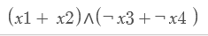

# Trabalho prático 1 - Plano de Campanha
## Algoritmos 1

<strong>Nome:</strong> Carlos Ferreira dos Santos Junior

## O problema

Para definir o seu plano de campanha, o deputado federal Alan Turing
resolveu utilizar a opinião do público através de enquetes no instagram.
Cada seguidor deve votar em até 2 propostas que deveriam continuar no
plano, e até 2 que deveriam sair.

A fim de agradar a todos os participantes, foi definido que pelo
menos uma de suas propostas votadas a favor deveria ser aceita e pelo
menos uma votada contra deveria ser retirada.

O problema se resume então a <strong>descobrir se existe alguma
atribuição que atenda esse critério e agrade a todos os
participantes</strong>. Note que não é necessário achar uma atribuição
específica, mas simplesmente determinar a existência de uma.

## Modelagem

Esse problema pode ser facilmente descrito como um problema de
satisfabilidade 2-SAT. É possível construir uma expressão booleana na
forma conjuntiva normal considerando cada par de votos como uma
cláusula. Votos a favor são literais normais e votos contra são literais
negados. Votos com um literal nulo equivalem a um voto só no literal não
nulo, e votos com ambos literais nulos são desconsiderados. No final,
determinar se é possível satisfazer essa expressão é equivalente a
responder ao problema original.

 

Transformando cada cláusula em duas implicações, podemos representar
essas implicações em arestas de um grafo direcionado.

Para criar esse grafo, cada variável corresponde a dois vértices (x e
not x) e as implicações correspondem a arestas entre esses vértices.

A expressão booleana não pode ser satisfeita se, e somente se,
existir um caminho de qualquer variável para a sua negativa e da sua
negativa de volta para si. Dada a propriedade transitiva de implicações
lógicas, isso significa uma implicação dupla entre x e not x, que não
pode ser verdadeira.

Poderíamos fazer essa verificação utilizando um algoritmo de busca
para cada variável, com um custo O(V*(V+A)). Uma maneira mais simples de
realizar tal verificação é utilizar o algoritmo de kosaraju ( O(V+A) )
para determinar os componentes fortemente conectados e verificar se cada
vértice está no mesmo conjunto que a sua negação, com um custo total
igual a O(V+A).

O algoritmo de kosaraju realiza uma DFS no grafo, armazena o tempo de
término de cada vértice, e por fim realiza uma DFS no grafo inverso
seguindo a ordem armazenada para construir cada componente fortemente
conectado.

## Implementação e estruturas de dados

Grafos - Para representar os grafos foi utilizado um vector de arrays
de inteiros, onde cada elemento é um vértice e os inteiros do array são
os vértices para os quais esse elemento possui uma aresta de saída.

Para execução do algoritmo de Kosaraju, foi utilizada uma Stack, que
por sua característica LIFO, armazena e retorna os vértices de acordo
com o seu tempo de parada para a execução da segunda DFS do algoritmo de
Kosaraju.

Foram ainda utilizados arrays para armazenar o componente fortemente
conectado de cada vértice e também arrays para registrar se um vértice
já foi visitado pela DFS ou não.

A principal função do programa é a função “isPossível”, que recebe
como entrada a quantidade de literais, a quantidade de cláusulas e dois
vetores correspondendo à expressão na forma conjuntiva normal (o
primeiro vetor contém o lado esquerdo de cada cláusula e o segundo o
lado direito).

Com base nessas entradas, a função gera o grafo de implicação
correspondente e também o seu inverso, que são utilizados em cada um dos
passos do Kosaraju. Por fim, é verificada a qual componente cada
variável e a sua negativa pertencem e retornado “nao” na saída padrão se
para algum deles for igual, ou “sim” caso contrário.

## Entrada
O programa recebe um arquivo de texto com os seguintes atributos:
- Uma linha com dois inteiros indicando a quantidade de eleitores e de propostas, respectivamente
- Uma linha para cada eleitor, representando seus votos com inteiros
- O final da leitura e do arquivo é definido pela entrada "0 0"

## Execução
Utilize o comando "make all" para gerar o executável "tp01" e rode-o com o nome do arquivo de entrada como argumento.
